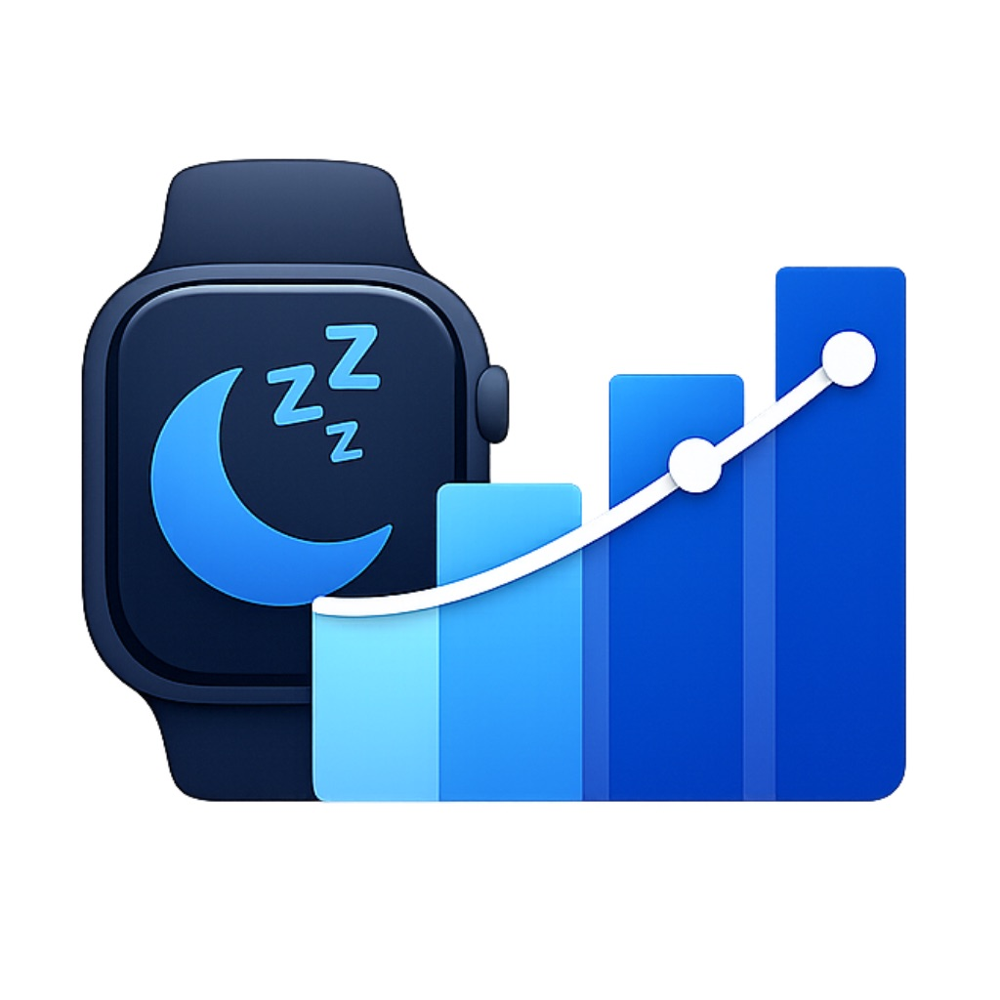
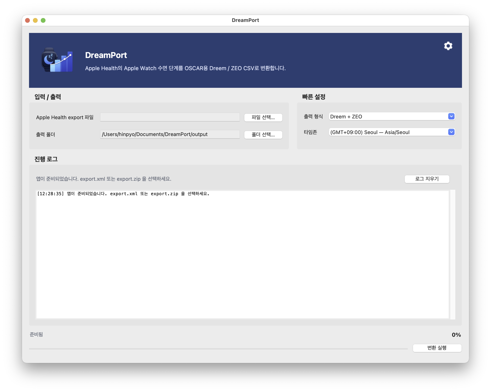

<p align="left">
  
</p>

# DreamPort

Apple Health의 수면 데이터(`export.xml` 또는 `export.zip`)를 읽어, OSCAR에서 import 가능한 **Dreem CSV** 및 **ZEO CSV**로 변환하는 크로스플랫폼 데스크톱 앱입니다.

이 프로젝트는 **Apple Watch / Apple Health 수면 단계 데이터 → OSCAR 친화적인 수면 파일**로 이어지는 변환 워크플로를 GUI 중심으로 제공합니다.

## 핵심 기능

- Apple Health 내보내기 파일 지원: `export.xml`, `export.zip`
- OSCAR import용 출력 지원:
  - Dreem CSV (`*.dreem.csv`)
  - ZEO CSV (`*.zeo.csv`)
- **증분 변환(incremental conversion)** 지원
  - 이전 변환 결과를 manifest로 기록하고, 다음 실행 시 재사용 가능한 파일은 다시 생성하지 않습니다.
- 타임존 선택 지원
- 다국어 UI 리소스 포함
- PyInstaller 기반 macOS / Windows 빌드 지원

## 스크린샷

### 한국어 UI



## 동작 개요

앱의 기본 흐름은 단순합니다.

1. Apple Health export 파일 선택
2. 출력 폴더 선택
3. 출력 형식 선택 (`Dreem`, `ZEO`, `Both`)
4. 타임존 선택
5. 변환 실행

고급 옵션은 Preferences 창에서 관리합니다.

## 저장소 구조

```text
.
├─ dreamport_gui.py
├─ pyproject.toml
├─ requirements.txt
├─ LICENSE
├─ README.md
├─ assets/
│  ├─ dreamport_header_icon.png
│  ├─ icon_no_bg.png
│  ├─ oscar_icon.png
│  ├─ oscar_icon_runtime.png
│  ├─ oscar_icon_macos.png
│  ├─ oscar_icon.ico
│  ├─ oscar_icon.icns
│  └─ settings.png
├─ scripts/
│  ├─ prepare_icons.py
│  ├─ build_app.py
│  └─ archive_dist.py
├─ src/
│  └─ apple_health_to_oscar/
│     ├─ __init__.py
│     ├─ __main__.py
│     ├─ app_paths.py
│     ├─ engine.py
│     ├─ gui.py
│     ├─ i18n.py
│     ├─ options.py
│     ├─ settings_store.py
│     ├─ timezones.py
│     ├─ version.py
│     └─ resources/
│        ├─ timezones.json
│        └─ locales/
└─ tests/
   ├─ fixtures/
   ├─ test_engine_regression.py
   └─ test_i18n_and_timezones.py
```

## 작동 방식

### 1) 입력 파싱

변환 엔진은 Apple Health에서 내보낸 `export.xml` 또는 `export.zip` 내부의 `export.xml`을 읽습니다.

- ZIP이 들어오면 내부의 `export.xml`을 찾아 스트리밍 방식으로 처리합니다.
- 수면 관련 레코드만 선별합니다.
- 필요하면 source 필터(`source_contains`)를 적용해 원하는 기기/소스만 대상으로 변환할 수 있습니다.

### 2) 세션 재구성

Apple Health의 수면 단계 레코드는 그대로 OSCAR 형식이 아니므로, 엔진이 이를 밤 단위 세션으로 재구성합니다.

- 인접한 수면 레코드를 하나의 수면 세션으로 묶습니다.
- `cluster_gap_hours` 같은 설정을 사용해 세션 경계를 판단합니다.
- Awake / REM / Core / Deep 등 Apple Health 단계 데이터를 Dreem/ZEO가 기대하는 필드로 매핑합니다.

### 3) 출력 생성

세션별로 다음 결과물을 생성합니다.

- `Dreem/<prefix>_YYYY-MM-DD_HHMM.dreem.csv`
- `ZEO/<prefix>_YYYY-MM-DD_HHMM.zeo.csv`

기본 파일 prefix는 `AppleWatch_OSCAR` 입니다.

### 4) 증분 처리

출력 폴더에는 `apple_watch_to_oscar_manifest.csv`가 생성됩니다.

이 manifest에는 이전에 생성한 세션의 시작/종료 시각과 출력 파일 경로가 기록됩니다. 다음 실행 시에는 이를 바탕으로:

- 이미 생성된 세션 파일은 재사용하고
- 새로 생긴 세션만 추가 생성하며
- 필요할 경우 `rebuild_all` 옵션으로 전체 재생성을 수행합니다.

이 방식 덕분에 반복 실행 시 속도가 빨라지고, 이미 만들어 둔 파일을 불필요하게 덮어쓰지 않습니다.

## 코드 구조 설명

### `dreamport_gui.py`
루트 진입점입니다. `src/`를 `sys.path`에 추가한 뒤 GUI 메인 함수를 실행합니다.

### `src/apple_health_to_oscar/gui.py`
Tkinter 기반 데스크톱 UI입니다.

주요 역할:
- 입력/출력 경로 선택
- 출력 형식 및 타임존 선택
- Preferences UI 제공
- 백그라운드 스레드에서 변환 실행
- 로그/상태 표시
- 앱 아이콘 및 다국어 리소스 로딩

### `src/apple_health_to_oscar/engine.py`
핵심 변환 엔진입니다.

주요 역할:
- `export.xml` / `export.zip` 처리
- 수면 레코드 추출
- 밤 단위 세션 재구성
- Dreem/ZEO CSV 생성
- manifest 로드/저장
- 증분 변환 및 기존 파일 재사용

외부에서 가장 중요하게 사용하는 API는 다음 두 가지입니다.

- `ConversionConfig`
- `run_conversion(...)`

### `src/apple_health_to_oscar/options.py`
UI와 설정 저장에서 공통으로 쓰는 옵션 메타데이터를 정의합니다.

예:
- `output_format`
- `timezone`
- `ui_language`
- `prefix`
- `gap_policy`
- `cluster_gap_hours`
- `incremental_overlap_days`
- `rebuild_all`

### `src/apple_health_to_oscar/settings_store.py`
사용자 설정을 JSON 파일로 저장/로드합니다.

- 현재 설정 파일 저장
- 레거시 설정 파일 경로 호환
- 기본값 병합

### `src/apple_health_to_oscar/app_paths.py`
개발 실행 / 패키징 실행(PyInstaller) 환경 모두에서 정상 동작하도록 경로를 계산합니다.

예:
- 리소스 경로
- 설정 파일 경로
- 사용자 설정 디렉터리
- 번들 실행 시 base path 처리

### `src/apple_health_to_oscar/i18n.py`
언어 리소스를 로드하고 시스템 언어 감지를 돕습니다.

### `src/apple_health_to_oscar/timezones.py`
타임존 카탈로그를 로드하고, UI에서 표시할 타임존 레이블 및 검색 문자열을 구성합니다.

### `scripts/prepare_icons.py`
원본 PNG를 바탕으로 런타임/배포용 아이콘을 생성합니다.

생성 대상:
- Windows `.ico`
- macOS `.icns`
- 런타임 PNG
- 헤더 이미지

### `scripts/build_app.py`
PyInstaller 빌드 스크립트입니다.

플랫폼별 동작:
- **macOS**: `DreamPort.app` (`--onedir`)
- **Windows**: `DreamPort.exe` (`--onefile`)

빌드 시 다음 리소스를 번들에 포함합니다.

- `assets/`
- `src/apple_health_to_oscar/resources/`
- `tzdata`

### `scripts/archive_dist.py`
빌드 결과물을 릴리스용 ZIP으로 압축합니다.

예:
- `dreamport-0.1.0-macos.zip`
- `dreamport-0.1.0-windows-x64.zip`

## 요구 사항

- Python 3.9+
- macOS 또는 Windows
- 빌드 시 의존성:
  - Pillow
  - PyInstaller
  - tzdata

## 개발 환경 실행

### 1) 저장소 클론

```bash
git clone <YOUR_GITHUB_REPO_URL>
cd dreamport-desktop
```

### 2) 가상환경 생성 및 활성화

#### macOS / Linux

```bash
python3 -m venv .venv
source .venv/bin/activate
```

#### Windows (PowerShell)

```powershell
py -3 -m venv .venv
.\.venv\Scripts\Activate.ps1
```

### 3) 의존성 설치

#### macOS / Linux

```bash
python -m pip install --upgrade pip
python -m pip install -r requirements.txt
```

#### Windows

```powershell
python -m pip install --upgrade pip
python -m pip install -r requirements.txt
```

### 4) 로컬 실행

#### 방법 A: 루트 진입점 실행

```bash
python dreamport_gui.py
```

#### 방법 B: 모듈 실행

```bash
python -m apple_health_to_oscar
```

> `python -m apple_health_to_oscar` 방식은 패키지 형태 실행에 가깝고, `dreamport_gui.py`는 저장소 루트에서 실행할 때 편리한 진입점입니다.

## 빌드 방법

아래 명령은 **해당 운영체제에서 직접 실행**하는 것을 전제로 합니다.

---

### macOS 빌드

```bash
python3 -m venv .venv
source .venv/bin/activate
python -m pip install --upgrade pip
python -m pip install -r requirements.txt
python scripts/prepare_icons.py
python scripts/build_app.py
python scripts/archive_dist.py --platform macos --version 0.1.0
```

빌드 결과:

- 앱 번들: `dist/DreamPort.app`
- 릴리스 ZIP: `release-assets/dreamport-0.1.0-macos.zip`

---

### Windows 빌드

```powershell
py -3 -m venv .venv
.\.venv\Scripts\Activate.ps1
python -m pip install --upgrade pip
python -m pip install -r requirements.txt
python scripts/prepare_icons.py
python scripts/build_app.py
python scripts/archive_dist.py --platform windows-x64 --version 0.1.0
```

빌드 결과:

- 실행 파일: `dist/DreamPort.exe`
- 릴리스 ZIP: `release-assets/dreamport-0.1.0-windows-x64.zip`

## 테스트

```bash
python -m unittest discover -s tests
```

현재 테스트는 다음을 검증합니다.

- Dreem / ZEO 결과 파일 생성
- 재실행 시 manifest 기반 재사용 동작
- 타임존 카탈로그가 주요 오프셋을 포함하는지
- i18n / 타임존 관련 보조 동작

## 출력 예시

출력 폴더는 보통 다음과 같은 형태가 됩니다.

```text
output/
├─ Dreem/
│  └─ AppleWatch_OSCAR_2026-03-09_0100.dreem.csv
├─ ZEO/
│  └─ AppleWatch_OSCAR_2026-03-09_0100.zeo.csv
└─ apple_watch_to_oscar_manifest.csv
```

## 배포 시 참고 사항

### macOS

- 서명되지 않은 로컬 빌드는 Gatekeeper 경고가 발생할 수 있습니다.
- 배포용 앱은 `.icns` 아이콘을 사용합니다.
- notarization/signing은 별도 구성 대상입니다.

### Windows

- 코드 서명되지 않은 `.exe`는 SmartScreen 경고가 발생할 수 있습니다.
- Windows 빌드는 PyInstaller `onefile` 전략을 사용합니다.

## 라이선스

이 프로젝트는 **GNU General Public License v3.0 (GPLv3)** 를 따릅니다.

자세한 내용은 [`LICENSE`](./LICENSE)를 참고하세요.

## 기여

버그 리포트, 재현 가능한 샘플, UI/번역 개선, 빌드 자동화 PR을 환영합니다.
