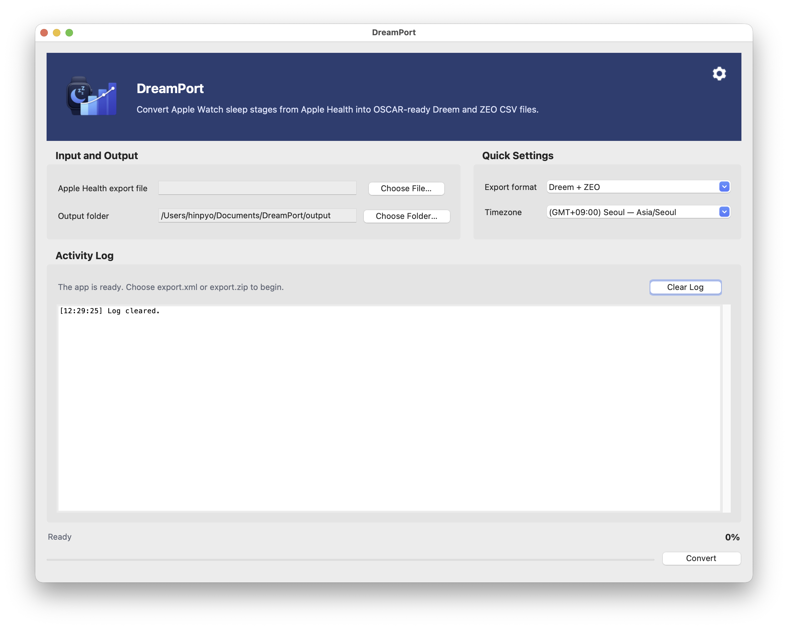

<table>
  <tr>
    <td width="72">
      
    </td>
    <td>
      <h1>DreamPort</h1>
    </td>
  </tr>
</table>

DreamPort is a cross-platform desktop app that reads Apple Health sleep data (`export.xml` or `export.zip`) and converts it into **Dreem CSV** and **ZEO CSV** formats that can be imported into OSCAR.

This project provides a GUI-first workflow for converting **Apple Watch / Apple Health sleep stage data into OSCAR-friendly sleep files**.

## Key Features

- Supports Apple Health export files: `export.xml`, `export.zip`
- Supports OSCAR import output formats:
  - Dreem CSV (`*.dreem.csv`)
  - ZEO CSV (`*.zeo.csv`)
- Supports **incremental conversion**
  - Previously converted sessions are tracked in a manifest so reusable files are not regenerated on later runs.
- Time zone selection support
- Includes multilingual UI resources
- PyInstaller-based macOS / Windows build support

## Screenshots

### Korean UI


### English UI



## Workflow Overview

The app flow is intentionally simple:

1. Select an Apple Health export file
2. Select an output folder
3. Choose an output format (`Dreem`, `ZEO`, or `Both`)
4. Select a time zone
5. Run the conversion

Advanced options are managed in the Preferences window.

## Repository Structure

```text
.
├─ dreamport_gui.py
├─ pyproject.toml
├─ requirements.txt
├─ LICENSE
├─ README.md
├─ README_EN.md
├─ assets/
│  ├─ dreamport_header_icon.png
│  ├─ icon_no_bg.png
│  ├─ oscar_icon.png
│  ├─ oscar_icon_runtime.png
│  ├─ oscar_icon_macos.png
│  ├─ oscar_icon.ico
│  ├─ oscar_icon.icns
│  └─ settings.png
├─ scripts/
│  ├─ prepare_icons.py
│  ├─ build_app.py
│  └─ archive_dist.py
├─ src/
│  └─ apple_health_to_oscar/
│     ├─ __init__.py
│     ├─ __main__.py
│     ├─ app_paths.py
│     ├─ engine.py
│     ├─ gui.py
│     ├─ i18n.py
│     ├─ options.py
│     ├─ settings_store.py
│     ├─ timezones.py
│     ├─ version.py
│     └─ resources/
│        ├─ timezones.json
│        └─ locales/
└─ tests/
   ├─ fixtures/
   ├─ test_engine_regression.py
   └─ test_i18n_and_timezones.py
```

## How It Works

### 1) Input Parsing

The conversion engine reads either `export.xml` exported from Apple Health or `export.xml` contained inside `export.zip`.

- If a ZIP file is provided, the app locates `export.xml` inside it and processes it in a streaming-friendly way.
- Only sleep-related records are selected.
- If needed, a source filter (`source_contains`) can be applied so conversion only uses records from a specific device or source.

### 2) Session Reconstruction

Apple Health sleep stage records are not already in OSCAR format, so the engine reconstructs them into night-based sleep sessions.

- Adjacent sleep records are grouped into a single sleep session.
- Settings such as `cluster_gap_hours` are used to decide session boundaries.
- Apple Health stages such as Awake / REM / Core / Deep are mapped into fields expected by Dreem and ZEO.

### 3) Output Generation

The app generates the following per-session outputs:

- `Dreem/<prefix>_YYYY-MM-DD_HHMM.dreem.csv`
- `ZEO/<prefix>_YYYY-MM-DD_HHMM.zeo.csv`

The default file prefix is `AppleWatch_OSCAR`.

### 4) Incremental Processing

The output folder contains `apple_watch_to_oscar_manifest.csv`.

This manifest stores previously generated session start/end times and output file paths. On later runs, the app uses it to:

- reuse already generated session files,
- create only newly detected sessions, and
- rebuild everything when the `rebuild_all` option is enabled.

This makes repeat runs faster and avoids unnecessarily overwriting files that have already been created.

## Code Structure

### `dreamport_gui.py`
The root entry point. It adds `src/` to `sys.path` and then launches the GUI main function.

### `src/apple_health_to_oscar/gui.py`
The Tkinter-based desktop UI.

Main responsibilities:
- selecting input/output paths,
- choosing output format and time zone,
- providing the Preferences UI,
- running conversion in a background thread,
- displaying logs and status, and
- loading app icons and multilingual resources.

### `src/apple_health_to_oscar/engine.py`
The core conversion engine.

Main responsibilities:
- handling `export.xml` / `export.zip`,
- extracting sleep records,
- reconstructing night-based sessions,
- generating Dreem/ZEO CSV files,
- loading/saving the manifest, and
- incremental conversion and reuse of existing files.

The two most important external APIs are:

- `ConversionConfig`
- `run_conversion(...)`

### `src/apple_health_to_oscar/options.py`
Defines option metadata shared by the UI and persisted settings.

Examples:
- `output_format`
- `timezone`
- `ui_language`
- `prefix`
- `gap_policy`
- `cluster_gap_hours`
- `incremental_overlap_days`
- `rebuild_all`

### `src/apple_health_to_oscar/settings_store.py`
Loads and saves user settings as a JSON file.

Responsibilities include:
- storing the current settings file,
- compatibility with legacy settings file paths, and
- merging defaults.

### `src/apple_health_to_oscar/app_paths.py`
Computes paths so the app works correctly in both development and packaged (PyInstaller) environments.

Examples:
- resource paths,
- settings file path,
- user settings directory, and
- base path handling for bundled execution.

### `src/apple_health_to_oscar/i18n.py`
Loads language resources and helps detect the system language.

### `src/apple_health_to_oscar/timezones.py`
Loads the time zone catalog and builds the display labels and search strings used by the UI.

### `scripts/prepare_icons.py`
Generates runtime and distribution icons from the source PNG assets.

Generated outputs include:
- Windows `.ico`
- macOS `.icns`
- runtime PNG
- header image

### `scripts/build_app.py`
PyInstaller build script.

Platform-specific behavior:
- **macOS**: `DreamPort.app` (`--onedir`)
- **Windows**: `DreamPort.exe` (`--onefile`)

The build bundles the following resources:

- `assets/`
- `src/apple_health_to_oscar/resources/`
- `tzdata`

### `scripts/archive_dist.py`
Compresses build outputs into release ZIP files.

Examples:
- `dreamport-0.1.0-macos.zip`
- `dreamport-0.1.0-windows-x64.zip`

## Requirements

- Python 3.9+
- macOS or Windows
- Build-time dependencies:
  - Pillow
  - PyInstaller
  - tzdata

## Running in a Development Environment

### 1) Clone the repository

```bash
git clone <YOUR_GITHUB_REPO_URL>
cd dreamport-desktop
```

### 2) Create and activate a virtual environment

#### macOS / Linux

```bash
python3 -m venv .venv
source .venv/bin/activate
```

#### Windows (PowerShell)

```powershell
py -3 -m venv .venv
.\.venv\Scripts\Activate.ps1
```

### 3) Install dependencies

#### macOS / Linux

```bash
python -m pip install --upgrade pip
python -m pip install -r requirements.txt
```

#### Windows

```powershell
python -m pip install --upgrade pip
python -m pip install -r requirements.txt
```

### 4) Run locally

#### Method A: Run the root entry point

```bash
python dreamport_gui.py
```

#### Method B: Run as a module

```bash
python -m apple_health_to_oscar
```

> `python -m apple_health_to_oscar` is closer to package-style execution, while `dreamport_gui.py` is a convenient entry point when launching directly from the repository root.

## Build Instructions

The commands below assume that you are building **directly on the target operating system**.

---

### macOS Build

```bash
python3 -m venv .venv
source .venv/bin/activate
python -m pip install --upgrade pip
python -m pip install -r requirements.txt
python scripts/prepare_icons.py
python scripts/build_app.py
python scripts/archive_dist.py --platform macos --version 0.1.0
```

Build outputs:

- App bundle: `dist/DreamPort.app`
- Release ZIP: `release-assets/dreamport-0.1.0-macos.zip`

---

### Windows Build

```powershell
py -3 -m venv .venv
.\.venv\Scripts\Activate.ps1
python -m pip install --upgrade pip
python -m pip install -r requirements.txt
python scripts/prepare_icons.py
python scripts/build_app.py
python scripts/archive_dist.py --platform windows-x64 --version 0.1.0
```

Build outputs:

- Executable: `dist/DreamPort.exe`
- Release ZIP: `release-assets/dreamport-0.1.0-windows-x64.zip`

## Tests

```bash
python -m unittest discover -s tests
```

The current tests verify:

- Dreem / ZEO output file generation
- manifest-based reuse behavior on repeated runs
- whether the time zone catalog includes key offsets
- helper behavior related to i18n and time zones

## Example Output

The output folder typically looks like this:

```text
output/
├─ Dreem/
│  └─ AppleWatch_OSCAR_2026-03-09_0100.dreem.csv
├─ ZEO/
│  └─ AppleWatch_OSCAR_2026-03-09_0100.zeo.csv
└─ apple_watch_to_oscar_manifest.csv
```

## Distribution Notes

### macOS

- Unsigned local builds may trigger Gatekeeper warnings.
- The distributed app uses an `.icns` icon.
- Notarization and code signing are out of scope for this repository and need to be configured separately.

### Windows

- Unsigned `.exe` builds may trigger SmartScreen warnings.
- The Windows build uses the PyInstaller `onefile` strategy.

## License

This project is licensed under the **GNU General Public License v3.0 (GPLv3)**.

See [`LICENSE`](./LICENSE) for details.

## Recommended GitHub Cleanup Before Publishing

Before publishing this as an open-source repository, it helps to also prepare the following:

- add a one-line project summary in the repository About section,
- attach macOS / Windows ZIP files to GitHub Releases,
- add one or two screenshots,
- use `CHANGELOG.md` or GitHub Releases if you plan to track future updates, and
- optionally add platform build automation under `.github/workflows/`.

## Contributing

Bug reports, reproducible samples, UI/translation improvements, and build automation PRs are welcome.
